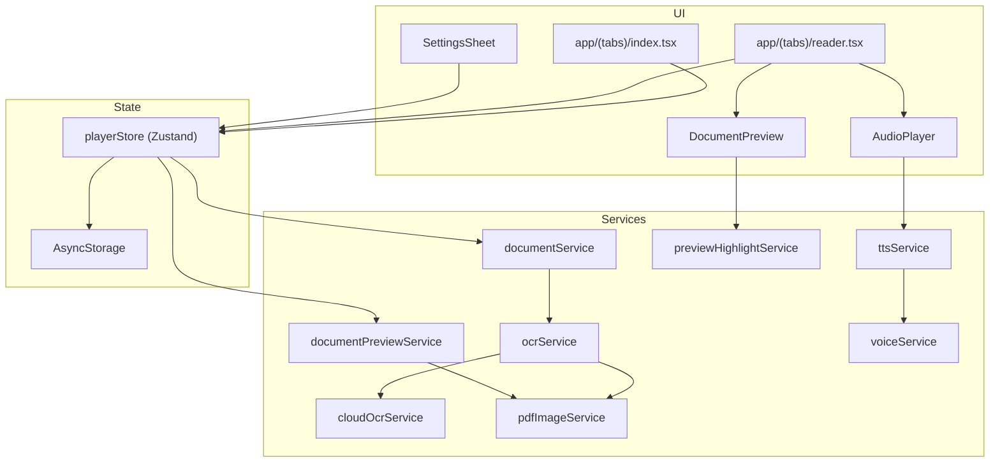
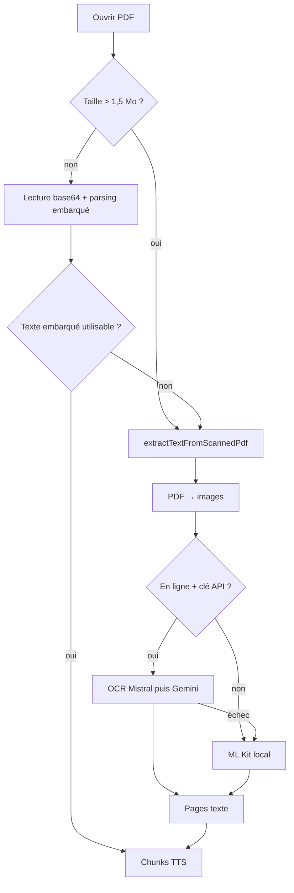

# Documentation ALD-Reader (docuvoice-expo)

Application mobile **ALD-Reader** : lecture audio de documents **PDF**, **EPUB** et **TXT** via synthèse vocale (TTS), avec aperçu visuel, surlignage de la phrase en cours et extraction de texte intelligente (embarquée + OCR local ou cloud).

| Métadonnée | Valeur |
|------------|--------|
| Nom affiché | ALD-Reader |
| Slug Expo | `docuvoice` |
| Package / bundle | `com.docuvoice.app` |
| Compte EAS | `@delmat237` |
| Projet EAS | `d8bc2ddf-eb8f-45a6-b135-b9fae54bac5f` |
| Version app (`app.json`) | 1.0.5 |
| `runtimeVersion` (OTA) | 1.0.5 |

---

## Table des matières

1. [Vue d'ensemble](#1-vue-densemble)
2. [Fonctionnalités](#2-fonctionnalités)
3. [Installation et développement](#3-installation-et-développement)
4. [Guide utilisateur](#4-guide-utilisateur)
5. [Architecture logicielle](#5-architecture-logicielle)
6. [Extraction de texte](#6-extraction-de-texte)
7. [OCR (local et cloud)](#7-ocr-local-et-cloud)
8. [Aperçu document et surlignage](#8-aperçu-document-et-surlignage)
9. [Synthèse vocale et voix](#9-synthèse-vocale-et-voix)
10. [État, cache et persistance](#10-état-cache-et-persistance)
11. [Configuration et clés API](#11-configuration-et-clés-api)
12. [Déploiement (EAS)](#12-déploiement-eas)
13. [Structure du dépôt](#13-structure-du-dépôt)
14. [Dépannage](#14-dépannage)
15. [Limitations connues](#15-limitations-connues)

---

## 1. Vue d'ensemble

ALD-Reader cible les utilisateurs qui souhaitent **écouter** leurs documents plutôt que les lire à l'écran. Le parcours principal :

1. Importer un fichier depuis l'appareil (`expo-document-picker`).
2. Extraire le texte (méthode selon le format).
3. Afficher un aperçu (pages PDF en images, texte brut pour TXT).
4. Lire le contenu avec **expo-speech**, phrase par phrase, avec surlignage sur l'aperçu quand c'est possible.
5. Sauvegarder la progression et le texte extrait localement (`AsyncStorage`).

**Stack principale :** Expo SDK 54, React Native 0.81, TypeScript, Expo Router v6, Zustand, modules natifs (ML Kit, `react-native-pdf-to-image`).

> **Important :** l'application repose sur des **modules natifs** (OCR, conversion PDF). Elle ne fonctionne pas entièrement dans **Expo Go** standard ; utilisez un **development build** ou une **build EAS** (profil `preview` ou `production`).

---

## 2. Fonctionnalités

| Domaine | Détail |
|---------|--------|
| Formats | PDF, EPUB, TXT |
| Langues TTS | 12 langues (`src/types.ts` : fr, en, de, es, pt, ar, zh, ja, ko, it, ru, hi) |
| Voix | Liste des voix système filtrées par langue (`Speech.getAvailableVoicesAsync`) |
| Réglages lecture | Vitesse, tonalité, volume, thème clair/sombre |
| PDF texte natif | Parsing embarqué du flux PDF (sans OCR si le texte est fiable) |
| PDF scanné / image | OCR ML Kit on-device, ou Mistral / Gemini si en ligne + clé API |
| Aperçu | Rendu PDF haute résolution en cache ; TXT affiché en brut |
| Surlignage | Rectangles sur l'aperçu PDF alignés sur la phrase TTS en cours |
| Hors ligne | OCR local et TTS sans réseau ; cloud OCR nécessite Internet |
| Mises à jour | EAS Update (OTA) pour le JavaScript ; rebuild natif pour icônes / modules natifs |

---

## 3. Installation et développement

### 3.1 Prérequis

- **Node.js** 18 ou plus récent
- **npm** (le projet utilise `npm install --legacy-peer-deps` si besoin pour les peer deps)
- Compte [Expo](https://expo.dev) et accès au projet EAS `docuvoice`
- Pour builds locales Android : Android SDK ; pour iOS : Xcode (macOS)

### 3.2 Installation

```bash
git clone <url-du-repo>
cd docuvoice-expo
npm install
# en cas de conflits de peer dependencies :
npm install --legacy-peer-deps
```

### 3.3 Lancer en développement

```bash
npx expo start
```

Pour tester les modules natifs sur appareil :

```bash
npx expo run:android
# ou
npx expo run:ios
```

### 3.4 Vérification TypeScript

Le script de déploiement exécute `npx tsc --noEmit` avant une OTA (sauf avec `--skip-tsc`) :

```bash
npx tsc --noEmit
```

---

## 4. Guide utilisateur

### 4.1 Bibliothèque

- Onglet **Accueil** : liste des documents importés, progression, durée écoutée.
- Bouton **+** : ouvre le sélecteur de fichiers (PDF, EPUB, TXT).

### 4.2 Lecture

- Ouvrir un document lance l'écran **Lecteur**.
- Contrôles : lecture / pause, page précédente / suivante, barre de progression.
- Zone **aperçu** : image de la page PDF ou texte TXT ; la phrase en cours peut être surlignée (PDF).
- Zone **texte** : contenu extrait utilisé pour le TTS.

### 4.3 Paramètres (⚙️)

- **Langue** : influence la voix par défaut, le script OCR ML Kit et la locale TTS.
- **Voix** : choix parmi les voix installées sur l'appareil pour la langue sélectionnée.
- **Vitesse / tonalité / volume** : passés à `expo-speech`.
- **Clés API** (optionnel) :
  - **Mistral** : OCR cloud prioritaire (modèle vision `pixtral-12b-2409`).
  - **Google** : repli OCR cloud (`gemini-2.0-flash`).
- **Thème** : clair ou sombre.

### 4.4 Comportement selon le type de fichier

| Type | Extraction | Aperçu |
|------|------------|--------|
| **TXT** | Lecture UTF-8, découpage en chunks | Contenu brut |
| **EPUB** | Décompression ZIP + parsing HTML des chapitres | Pas d'aperçu image (texte seul) |
| **PDF** | Texte embarqué si valide, sinon OCR | Pages converties en PNG (cache) |

### 4.5 Première ouverture d'un PDF

L'extraction peut prendre **plusieurs secondes à quelques minutes** selon la taille, le nombre de pages et l'OCR (local ou cloud). Le texte extrait est **mis en cache** : les ouvertures suivantes sont plus rapides.

---

## 5. Architecture logicielle



### 5.1 Navigation (Expo Router)

| Fichier | Rôle |
|---------|------|
| `app/_layout.tsx` | Layout racine, thème |
| `app/(tabs)/_layout.tsx` | Onglets Accueil / Lecteur |
| `app/(tabs)/index.tsx` | Bibliothèque |
| `app/(tabs)/reader.tsx` | Lecture, aperçu, TTS |

### 5.2 État global

`src/store/playerStore.ts` centralise :

- liste des documents ;
- document et page courants ;
- pages de texte extrait ;
- réglages utilisateur ;
- état lecture (playing, chunk index, etc.) ;
- URIs d'aperçu PDF et texte TXT ;
- chargement aperçu / extraction.

---

## 6. Extraction de texte

Point d'entrée : `extractText(uri, type, settings)` dans `src/services/documentService.ts`.

### 6.1 Fichiers TXT

1. Lecture du fichier en UTF-8.
2. Nettoyage (`cleanText`).
3. Découpage en chunks (`splitIntoChunks`) pour le TTS et l'affichage.

### 6.2 Fichiers EPUB

1. Lecture binaire, décompression **JSZip**.
2. Parsing du OPF / spine et extraction HTML des chapitres.
3. Nettoyage balises → texte brut par chapitre/page logique.

### 6.3 Fichiers PDF



**Règles importantes :**

- **Seuil 1,5 Mo** : au-delà, pas de lecture base64 complète en JS (risque OOM) → OCR direct.
- **Pas de fallback « charabia »** : l'ancien parsing par regex sur le binaire PDF a été retiré ; si le texte embarqué est illisible (`embeddedPdfTextIsUsable` / `isGarbageText`), on bascule sur l'OCR.
- Les messages d'erreur utilisateur sont renvoyés comme **une page de texte** (pas d'exception bloquante dans certains cas) pour affichage dans l'UI.

---

## 7. OCR (local et cloud)

### 7.1 Conversion PDF → images

`src/services/pdfImageService.ts` :

- **Android** : priorité à `convertB64` (évite les erreurs *No content provider* avec `convert(uri)`).
- Copie du PDF dans le cache avec extension `.pdf`.
- Largeur de rendu calculée par `getPdfRenderWidthPx(purpose)` :
  - **`preview`** : ~largeur écran × densité, borné entre **1200** et **2560** px.
  - **`ocr`** : légèrement inférieur, borné entre **1080** et **2048** px.
- Limite **12 Mo** pour la conversion base64 locale.

### 7.2 ML Kit (local)

`src/services/ocrService.ts` :

- `@react-native-ml-kit/text-recognition` avec script selon la langue (Latin, Chinois, Japonais, Coréen, Devanagari).
- **`imageUriForMlKit`** : sur Android, conversion `file://` → `content://` via `FileSystem.getContentUriAsync` pour éviter *No content provider*.

### 7.3 OCR cloud

`src/services/cloudOcrService.ts` — conditions dans `extractTextFromScannedPdf` :

1. Appareil **en ligne** (`networkService`).
2. Au moins une clé **Mistral** ou **Google** résolue (`apiKeys.ts`).
3. Sinon → ML Kit uniquement.

Ordre cloud : **Mistral** (`pixtral-12b-2409`) puis repli **Gemini** si Mistral échoue. En cas d'échec cloud global → repli ML Kit.

Limite : **25 pages** maximum en OCR cloud (`MAX_CLOUD_PAGES`).

### 7.4 Ordre de résolution des clés API

`src/config/apiKeys.ts` :

1. Clé saisie dans **Paramètres** (`PlayerSettings`).
2. `app.json` → `expo.extra.mistralApiKey` / `googleApiKey`.
3. Variables d'environnement `EXPO_PUBLIC_MISTRAL_API_KEY` / `EXPO_PUBLIC_GOOGLE_API_KEY` (build time).

---

## 8. Aperçu document et surlignage

### 8.1 Aperçu visuel

`src/services/documentPreviewService.ts` :

- **PDF** : génération d'images par page (même pipeline que preview dans `pdfImageService`), stockage des chemins en cache AsyncStorage (`@docuvoice_preview_v2_<docId>`).
- **TXT** : contenu brut pour affichage direct (pas de conversion image).

Composant UI : `src/components/DocumentPreview.tsx`, intégré dans `reader.tsx`.

### 8.2 Surlignage « En lecture »

`src/services/previewHighlightService.ts` :

- Utilise les **lignes OCR** et les **cadres** ML Kit pour positionner des rectangles sur l'image de la page.
- Reçoit le **chunk TTS courant** (`currentChunkText` depuis `splitIntoSpeechChunks`).
- Si l'alignement échoue, un encart **« En lecture »** avec extrait de texte peut s'afficher en secours.

**Note :** le nombre de pages d'aperçu peut différer du nombre de pages de texte extrait ; l'index de page est **clampé** pour éviter les débordements.

---

## 9. Synthèse vocale et voix

### 9.1 TTS

`src/services/ttsService.ts` utilise **expo-speech** :

- Découpage du texte en chunks (`splitIntoSpeechChunks` dans `src/utils/text.ts`).
- Paramètres : `language` (locale), `rate`, `pitch`, `volume`, `voice` (id système).

### 9.2 Sélection des voix

`src/services/voiceService.ts` :

- `Speech.getAvailableVoicesAsync()` filtré par langue / locale.
- `selectedVoiceId` vide = voix par défaut du système pour la locale.

---

## 10. État, cache et persistance

### 10.1 Documents

Métadonnées des documents persistées via Zustand + AsyncStorage (liste, progression, page courante, temps écouté).

### 10.2 Cache du texte extrait

- Clé : `@docuvoice_content_v3_<documentId>`.
- **Version 3** : invalide les anciens caches après changements d'extraction (PDF / OCR).
- Les messages d'**échec d'extraction** ne sont **pas** recachés (`isCachedExtractionFailure`) pour permettre une nouvelle tentative après mise à jour OTA.

### 10.3 Cache aperçu

- Clé : `@docuvoice_preview_v2_<documentId>`.
- **Version 2** : résolution d'aperçu augmentée (fin du rendu 150 px flou).

### 10.4 Invalidation manuelle

Supprimer un document dans l'app retire ses entrées associées. Pour forcer une ré-extraction globale, incrémenter `CONTENT_CACHE_VERSION` dans `playerStore.ts` et publier une OTA.

---

## 11. Configuration et clés API

### 11.1 `app.json` (extraits utiles)

```json
{
  "expo": {
    "name": "ALD-Reader",
    "slug": "docuvoice",
    "runtimeVersion": "1.0.5",
    "updates": {
      "url": "https://u.expo.dev/d8bc2ddf-eb8f-45a6-b135-b9fae54bac5f",
      "checkAutomatically": "ON_LOAD"
    },
    "extra": {
      "mistralApiKey": "",
      "googleApiKey": ""
    }
  }
}
```

> Ne commitez **jamais** de vraies clés API dans le dépôt. Préférez les saisir dans l'app ou les secrets EAS / variables `EXPO_PUBLIC_*` en CI.

### 11.2 Profils EAS (`eas.json`)

| Profil | Canal | Android | Usage |
|--------|-------|---------|--------|
| `development` | — | APK debug | Dev client |
| `preview` | `preview` | APK internal | Tests, équipe |
| `production` | `production` | AAB | Store |

---

## 12. Déploiement (EAS)

Script principal : **`scripts/deploy.sh`**.

### 12.1 Commandes

| Commande | Description |
|----------|-------------|
| `ota [preview\|production]` | Publie une mise à jour JavaScript (EAS Update) |
| `build-android [profil]` | Build APK/AAB natif Android |
| `build-ios [profil]` | Build iOS (credentials) |
| `build-all [profil]` | Android puis iOS |
| `prebuild-android` | Régénère `android/` (icônes, ressources) |

Options globales :

- `--message "…"` / `-m` : message de l'update OTA
- `--no-wait` : ne pas attendre la fin du build sur les serveurs EAS
- `--skip-tsc` : ignorer la vérification TypeScript avant déploiement

### 12.2 Scripts npm

```bash
npm run deploy              # OTA preview (défaut)
npm run deploy:ota          # idem
npm run deploy:ota:prod     # OTA production
npm run deploy:android      # build Android preview
npm run deploy:android:prod # build Android production
```

### 12.3 Exemples

```bash
./scripts/deploy.sh ota preview --message "Correction OCR et aperçu HD"
./scripts/deploy.sh build-android preview --no-wait
./scripts/deploy.sh prebuild-android
./scripts/deploy.sh build-android preview
```

### 12.4 OTA vs build natif

| Changement | OTA suffit ? | Action |
|------------|--------------|--------|
| Code TypeScript / React | Oui | `deploy.sh ota` |
| `runtimeVersion` différente de la build installée | Non | Nouvelle build + OTA alignée |
| Nouveau module natif npm | Non | Rebuild EAS |
| Icône / splash / permissions Android | Non | `prebuild-android` + rebuild |
| `app.json` plugins natifs | Non | Rebuild |

Les utilisateurs doivent avoir une build avec **expo-updates** et la même **`runtimeVersion`** que l'update publiée.

### 12.5 Liens utiles

- Builds : https://expo.dev/accounts/delmat237/projects/docuvoice/builds  
- Updates : https://expo.dev/accounts/delmat237/projects/docuvoice/updates  

### 12.6 iOS en CI non interactif

Les builds iOS avec `--non-interactive` échouent si les **credentials** ne sont pas déjà configurés sur EAS. Relancer en mode interactif ou configurer les certificats dans le dashboard Expo.

---

## 13. Structure du dépôt

```
docuvoice-expo/
├── app/                    # Routes Expo Router
│   ├── (tabs)/
│   │   ├── index.tsx       # Bibliothèque
│   │   └── reader.tsx      # Lecteur
│   └── _layout.tsx
├── assets/                 # Icônes, splash
├── docs/
│   └── DOCUMENTATION.md    # Ce fichier
├── scripts/
│   └── deploy.sh           # Déploiement EAS
├── src/
│   ├── components/         # UI (DocumentPreview, AudioPlayer, …)
│   ├── config/
│   │   └── apiKeys.ts
│   ├── services/           # Logique métier
│   │   ├── documentService.ts
│   │   ├── ocrService.ts
│   │   ├── cloudOcrService.ts
│   │   ├── pdfImageService.ts
│   │   ├── documentPreviewService.ts
│   │   ├── previewHighlightService.ts
│   │   ├── ttsService.ts
│   │   ├── voiceService.ts
│   │   └── networkService.ts
│   ├── store/
│   │   └── playerStore.ts
│   ├── types.ts
│   ├── theme.ts
│   └── utils/
│       └── text.ts
├── app.json
├── eas.json
└── package.json
```

---

## 14. Dépannage

### « Ce PDF n'a pas pu être lu »

| Cause possible | Piste |
|----------------|-------|
| PDF protégé / corrompu | Tester avec un autre fichier |
| Fichier déplacé ou cache vidé | Réimporter le document |
| PDF très volumineux (> 12 Mo conversion) | Réduire la taille ou découper le PDF |
| Erreur *content provider* (Android) | Mettre à jour l'app (OTA récente avec fix URI ML Kit) |

### Texte en « charabia »

- Ancienne version : fallback binaire supprimé. Mettre à jour l'app et **supprimer le cache** (réouvrir le doc après OTA v3+ ou supprimer/réimporter).

### Aperçu flou

- Vérifier cache preview **v2** (réouvrir le document après mise à jour).

### Message OCR mentionnant les clés API alors que vous n'en utilisez pas

- L'échec peut venir du **chemin local** (conversion PDF, ML Kit). Vérifier les logs ; une OTA récente corrige souvent le problème Android.

### Icône Android = robot par défaut

- Si le dossier `android/` existe, Expo peut ignorer `app.json` pour les icônes.
- Exécuter `npx expo prebuild --platform android` puis **rebuild EAS** (l'OTA ne change pas l'icône).

### OTA non reçue

- `runtimeVersion` de la build installée ≠ celle de l'update.
- Canal EAS (`preview` vs `production`) ≠ celui de la build.
- Redémarrer complètement l'application.

### Build EAS en file d'attente

- Consulter https://status.expo.dev et le dashboard du projet.

---

## 15. Limitations connues

- **Expo Go** : modules natifs non supportés pour toutes les fonctions ; utiliser un dev build ou APK EAS.
- **EPUB** : pas d'aperçu visuel page par page comme pour le PDF.
- **OCR cloud** : plafonné à 25 pages ; coût et latence réseau.
- **Gros PDF** : extraction embarquée désactivée au-delà de 1,5 Mo ; conversion image limitée à 12 Mo.
- **Alignement surlignage** : qualité dépendante de la précision OCR sur la page courante.
- **iOS build automatisé** : nécessite credentials préconfigurés.
- **Web** : non cible principale du produit.

---

## Historique des versions de cache (référence développeur)

| Version | Clé / constante | Motif |
|---------|-----------------|--------|
| Contenu v3 | `CONTENT_CACHE_VERSION = 3` | Extraction PDF / OCR / fix Android |
| Aperçu v2 | `@docuvoice_preview_v2_` | Résolution aperçu HD |

---

*Documentation alignée sur le dépôt docuvoice-expo — ALD-Reader.*
